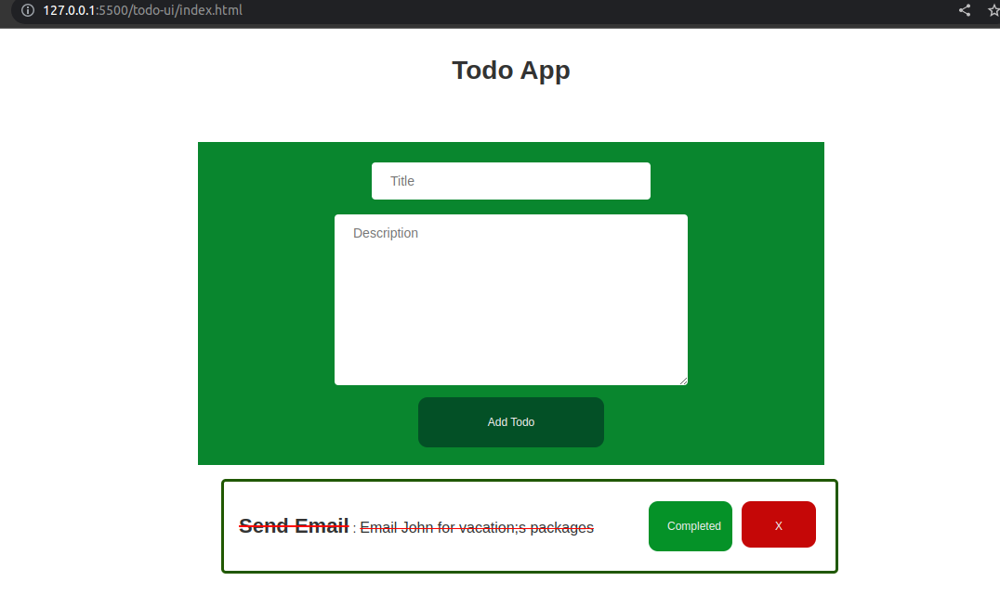

# Quiz 3 - Todo Api CRUD and Todo UI in ELM
### Todo-UI
> **Result**
> 

### Todo-API
> **Endpoints**
> - localhost:4000/v1/healthcheck
> - localhost:4000/v1/todos - Get all records
> - localhost:4000/v1/todos/:id - Update By ID,Get By ID,Delete By ID
> - localhost:4000/v1/todos - POST
> - localhost:4000/v1/todos?sort=title - Sort by title
> - localhost:4000/v1/todos?title=errands - search by title
> - localhost:4000/v1/tods?page=1&page_size=2 - pagination
